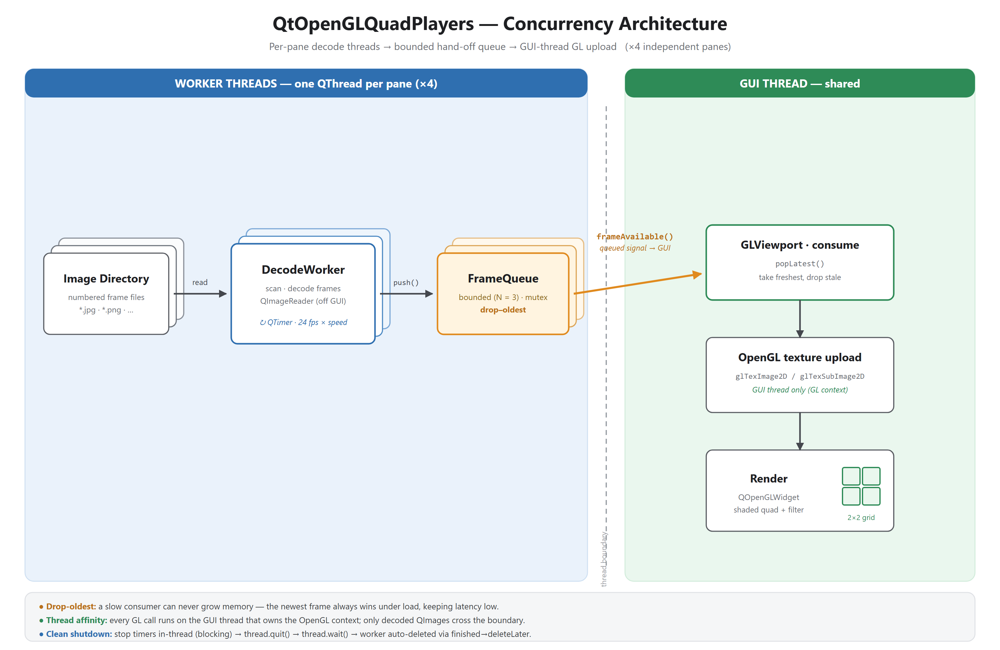

https://github.com/user-attachments/assets/85bec738-2b67-43f3-b2b4-68dd5b7e486c


# Qt OpenGL Quad Players

A multithreaded **Qt 6 / OpenGL** application that plays back image sequences in
a 2×2 grid of independent "players." Each pane decodes its own image sequence on
a dedicated worker thread and renders frames through an OpenGL textured quad with
selectable real-time GLSL filters.

## Demo

_The 2×2 grid playing four independent image sequences, each decoded on its own worker thread, with live per-pane metrics (fps, decode time, queue depth, dropped frames)._

<!-- VIDEO -->

## Features

- **2×2 grid of independent players**, each with its own transport controls.
- **Per-pane worker threads** — file scanning and JPEG/PNG decoding run off the
  GUI thread, so the UI stays responsive regardless of sequence size.
- **Thread-safe frame hand-off** — a bounded, mutex-guarded `FrameQueue` with
  drop-oldest backpressure; the GUI thread uploads only the freshest frame to
  the GL texture (GL calls stay on the thread that owns the context).
- **Live metrics** per pane — decode throughput (fps), average decode time,
  queue depth, dropped-frame count, position, and playback speed.
- **Real-time GLSL filters** — Normal, Grayscale, Invert, Edge, Blur, Pixelate,
  Textured, Sobel, GeomOutline.
- **Transport controls** — play, reverse, stop, speed up/down, with crisp
  vector icons drawn at runtime (no image assets, sharp at any DPI).
- **Clean shutdown** — worker threads are stopped deterministically and joined.

## Architecture

Each pane runs the pipeline below: decoding happens on a per-pane worker thread,
frames cross to the GUI thread through a bounded drop-oldest queue, and only the
GUI thread touches OpenGL.

```text
  WORKER THREAD  (one per pane — ×4)
  ┌────────────────────────┐
  │ Image Directory        │   numbered frames: *.jpg, *.png, ...
  └────────────────────────┘
              │  read
              ▼
  ┌────────────────────────┐
  │ DecodeWorker           │   scan + decode (QImageReader), OFF the GUI thread
  └────────────────────────┘   paced by a QTimer @ 24 fps x speed
              │  push()
              ▼
  ┌────────────────────────┐
  │ FrameQueue             │   bounded = 3, mutex-guarded
  └────────────────────────┘   drop-oldest: newest frame wins under load
              │  frameAvailable()   (queued signal)
══════════════╪═══════════════════════════  thread boundary  ══════════
              │  only a decoded QImage crosses here; no GL call ever does
              ▼
  GUI THREAD  (shared)
  ┌────────────────────────┐
  │ GLViewport.consume     │   popLatest() — take the freshest frame
  └────────────────────────┘
              ▼
  ┌────────────────────────┐
  │ OpenGL texture upload  │   glTexImage2D — GUI thread ONLY (GL context)
  └────────────────────────┘
              ▼
  ┌────────────────────────┐
  │ Render (QOpenGLWidget) │   shaded quad + filter, shown in a 2×2 grid
  └────────────────────────┘

  ×4 — four worker threads feed four GLViewports on the single GUI thread.
```

The same pipeline as a rendered diagram:



See **[ARCHITECTURE.md](ARCHITECTURE.md)** for the threading model, the queue's
drop-oldest rationale, and the shutdown ordering.

## Building (Windows, MinGW)

Requires Qt 6.9+ (MinGW 64-bit), CMake 3.21+, and Ninja. Using Qt's bundled
MinGW toolchain is recommended for ABI compatibility with the Qt libraries.

```sh
cmake -S . -B build -G Ninja -DCMAKE_BUILD_TYPE=Release
cmake --build build
```

A `windeployqt` post-build step runs automatically on Windows, so the resulting
`build/` directory is self-contained (Qt DLLs, image-format plugins, and the
MinGW runtime are copied next to the executable).

## Running

Launch with no arguments and load sequences via the 📁 button in each pane, or
preload panes by passing directory paths (row-major: top-left first):

```sh
build/QtOpenGLQuadPlayers.exe \
  "path/to/sequence_A" \
  "path/to/sequence_B" \
  "path/to/sequence_C" \
  "path/to/sequence_D"
```

Each directory should contain a numbered image sequence
(`*.png`, `*.jpg`, `*.jpeg`, `*.bmp`, `*.tif`, `*.tiff`, `*.webp`).

## License

This project's source code is released under the [MIT License](LICENSE).

> **Note on distributing binaries:** the compiled executable dynamically links
> the Qt libraries, which are licensed under the LGPLv3. Redistributing the
> built `.exe` therefore carries the usual LGPL obligations (include the Qt
> license texts and allow users to relink against their own Qt build). The MIT
> license above applies to *this project's own source code*, not to Qt.
